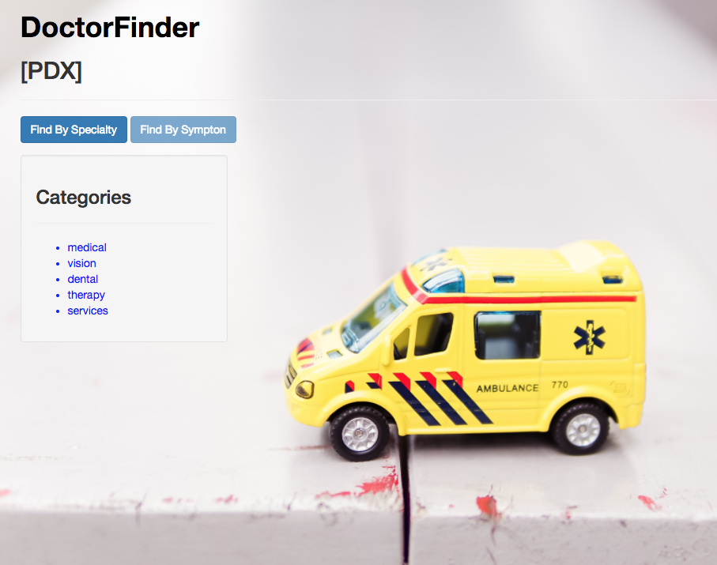
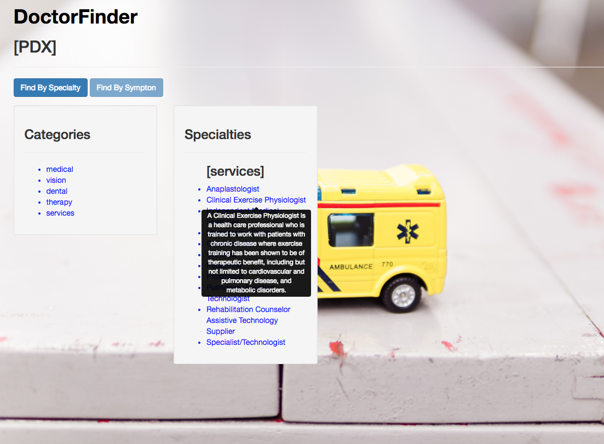
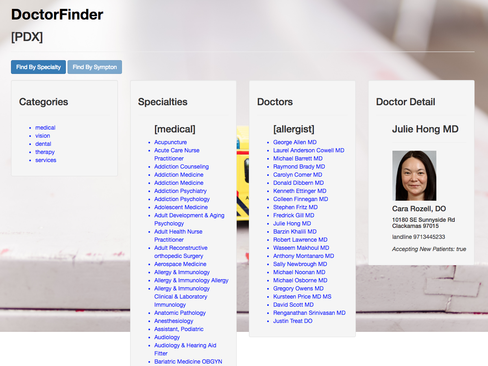

# PDX Doctor Lookup with BetterDoctorAPI

##### Epicodus Section: JavaScript Week2  API and Asynchrony

### By Jessica Sheridan

## Description
The Doctor Lookup Project uses the Better Doctor API to provide meaningful
data for a user to find a doctor. The website uses data centered on Portland,
OR. It currently does an API request for all Specialties that exist. The specialties
are sorted by Category, then alphabetically and provide a decscription of each
specialty when the user hovers. A user click on a Specialty does a second API
request for all doctors in the area for the given specialty. Further, another click
on a doctors name will provide useful details about the doctor, including their practice
name, number and address and if they are accepting new patients.

## Setup
* % git clone https://github.com/jessicakenney/doctor-lookup.git  
* % cd doctor-lookup
* create .env file to include BetterDoctor API Key
* % more .env
* exports.apiKey = "XXXXX";
* % npm install
* % bower install
* % gulp build
* % gulp serve

## Support and Contact details
email with any questions: jessicakenney@yahoo.com,

## Known Issues/Bugs
The current class="doctorId" being used to show specific doctor details needs to be expanded on
to avoid display multiple doctors with same last name within a speciality.

## Technologies Used
JavaScript, ES6, BetterDoctorAPI

### Legal
This software is licensed under MIT Copyright (c) 2017 Jessica Sheridan
